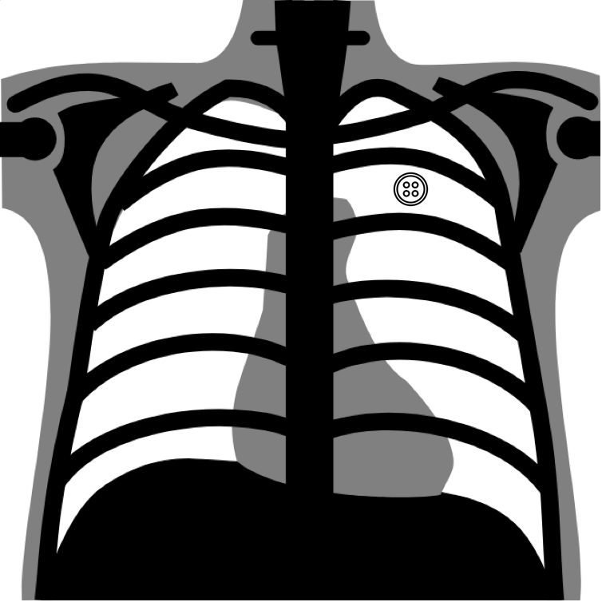

# object-CXR challenge
### Automatic detection of foreign objects on chest X-rays



- [Background](#background)
- [Data](#data)
- [Annotation](#annotation)
- [Evaluation](#evaluation)
- [Baseline](#baseline)
- [Organizers](#organizers)
- [Join](#join)

## Background
Analyzing chest X-rays is a common clinical approach for diagnosing pulmonary and heart diseases. However, foreign objects are occasionally presented on chest X-ray images, especially in rural and remote locations where standard filming guidances are not strictly followed. Foreign objects on chest X-rays may obscure pathological finds, thus increasing false negative diagnosis. They may also confuse junior radiologists from real pathological findings, e.g. buttons are visually similar to nodules on chest X-ray, thus increasing false positive diagnosis. Therefore, automatically detecting foreign objects on chest X-ray is important and may potentially improve overall diagnosis accuracy, e.g. by suggesting re-filming in the telemedicine setting.  

We provide a large dataset of chest X-rays with strong annotations of foreign objects, and the competition for automatic detection of foreign objects. Specifically, 5000 frontal chest X-ray images with foreign objects presented and 5000 frontal chest X-ray images without foreign objects are provided. All the chest X-ray images were filmed in township hospitals in China and collected through our telemedicine platform. Foreign objects within the lung field of each chest X-ray are annotated with bounding boxes, ellipses or masks depending on the shape of the objects.

Detecting foreign objects is particularly challenging for deep learning (DL) based systems, as specific types of objects presented in the test set may be rarely or never seen in the training set, thus posing a few-shot/zero-shot learning problem. We hope this open dataset and challenge could both help the development of automatic foreign objects detection system, and promote the general research of object detection on chest X-rays, as large scale chest X-ray datasets with strong annotations are limited to the best of our knowledge. 

## Data
5000 frontal chest X-ray images with foreign objects presented and 5000 frontal chest X-ray images without foreign objects were filmed and collected from about 300 township hosiptials in China. 12 medically-trained radiologists with 1 to 3 years of experience annotated all the images. Each annotator manually annotates the potential foreign objects on a given chest X-ray presented within the lung field. Foreign objects were annotated with bounding boxes, bounding ellipses or masks depending on the shape of the objects. Support devices were excluded from annotation. A typical frontal chest X-ray with foreign objects annotated looks like this:

We randomly split the 10000 images into training, validation and test dataset:

**training** 4000 chest X-rays with foreign objects presented; 4000 chest X-rays without foreign objects. 

**validation** 500 chest X-rays with foreign objects presented; 500 chest X-rays without foreign objects. 

**test** 500 chest X-rays with foreign objects presented; 500 chest X-rays without foreign objects. 


## Annotation

We provide object-level annotations for each image, which indicate the rough location of each foreign object using a closed shape.

Annotations are provided in csv files and a csv example is shown below.

```csv
image_name,annotation
#####.jpg,ANNO_TYPE_IDX x1 y1 x2 y2;ANNO_TYPE_IDX x1 y1 x2 y2 ... xn yn;...
#####.jpg,
#####.jpg,ANNO_TYPE_IDX x1 y1 x2 y2
...
```

Three type of shapes are used namely rectangle, ellipse and polygon. We use `0`, `1` and `2` as `ANNO_TYPE_IDX` respectively.

- For rectangle and ellipse annotations, we provide the bounding box (upper left and lower right) coordinates in the format `x1 y1 x2 x2` where `x1` < `x2` and `y1` < `y2`.

- For polygon annotations, we provide a sequence of coordinates in the format `x1 y1 x2 y2 ... xn yn`.

## Evaluation
We use two metrics to evaluate the classification and localization performance of foreign objects detection on chest X-rays: Area Under Curve (AUC) and  Free-response Receiver Operating Characteristic (FROC).

### Classification
For the test dataset, each algorithm is required to generate a `classification.csv` file in the format below:
```
#####.jpg,0.90
#####.jpg,0.85
#####.jpg,0.15
...
```
where each line corresponds to the prediciton result of one image. The first column is the image name, the second column is the predicted probability, ranging from 0 to 1, indicating whether this image has foregin objects or not.

We use AUC to evaluate the algorithm performance of classifying whether each given chest X-ray has foreign objects presented or not.

### Localization
For the test dataset, each algorithm is required to generate a `localization.csv` file in the format below:
```
#####.jpg,0.90 1000 500;0.80 200 400
#####.jpg,
#####.jpg,0.75 300 600;0.50 400 200;0.15 1000 200
...
```
where each line corresponds to the prediciton result of one image. The first column is the image name, the second column
is space seperated 3-element tuple of predicted foreign object coordinates with its probability in the format of (probability x y), where x and y are the width and height coordinates of the predicted foreign object. It is allowed to have zero predicted 3-element tuple for certain images, if there are no foreign objects presented. But please note the `,` after the first column even if the prediction is empty.

We use FROC to evaluate the algorithm performance of localizing foreign obects on each given chest X-ray. A foregin object is counted as detected as long as one predicted cooridinate lies within its annotation. The sensitivity is the number of detected foreign objects dividide by the number of total foreign objects. A predicted coordinate is false positive, if it lies outside any foreign object annotation. When the numbers of false positive coordinates per image are 1, 2, 4, 8, 16, 32 , FROC is the average sensitivty of these different versions of predictions. 

`froc.py` provides the details of how FROC is computed.


## Baseline

## Organizers

## Join
